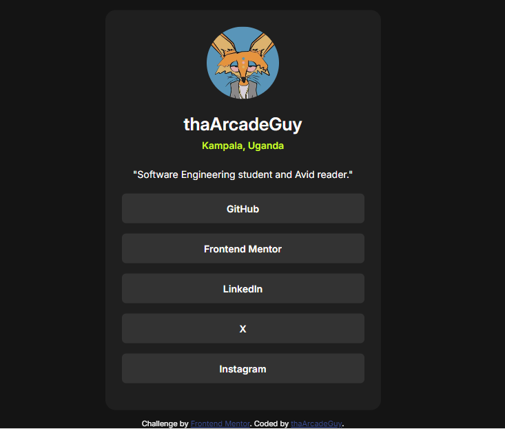

# Frontend Mentor - Social links profile solution

This is a solution to the [Social links profile challenge on Frontend Mentor](https://www.frontendmentor.io/challenges/social-links-profile-UG32l9m6dQ). Frontend Mentor challenges help you improve your coding skills by building realistic projects. 

## Table of contents

- [Overview](#overview)
  - [The challenge](#the-challenge)
  - [Screenshot](#screenshot)
  - [Links](#links)
- [My process](#my-process)
  - [Built with](#built-with)
  - [What I learned](#what-i-learned)
  - [Continued development](#continued-development)
- [Author](#author)
- [Acknowledgments](#acknowledgments)

## Overview

### The challenge

Users should be able to:

- See hover and focus states for all interactive elements on the page

### Screenshot




### Links

- Solution URL: (https://www.frontendmentor.io/solutions/personalized-social-links-profile-AwtdUvBurK)
- Live Site URL: (https://thaarcadeguy.github.io/social-links-profile/)

## My process

### Built with

- HTML5 markup
- CSS 

### What I learned

I learnt how to use CSS `position` and `transform` properties in order to center a component horizontally and vertically. And also using Media Queries in RWD

```css
body {
    position: relative;
    height: 100vh;
}

.profile-card {
    position: absolute;
    top: 50%;
    left: 50%;
    transform: translate(-50%, -50%);
}
```
```css
@media screen and (max-width: 600px) {
    .profile-card {
        width: 300px;
    }
}
```

### Continued development

- Media Queries

## Author

- Discord - [@thaArcadeGuy](https://discord.com/channels/@me)
- Frontend Mentor - [@thaArcadeGuy](https://www.frontendmentor.io/profile/thaArcadeGuy)
- X - [@thaArcadeGuy](https://www.x.com/thaArcadeGuy)

## Acknowledgments

Big shoutouts to [Hale](https://www.frontendmentor.io/profile/halelite)
